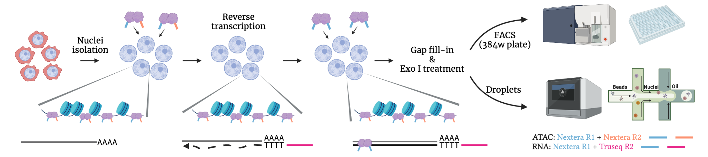

# In Situ SHERRY After ATAC-seq (ISSAAC-seq)
ISSAAC-seq is a single-cell multiomic method for simultaneous profiling of chromatin accessibility and gene expression from the same cell.




(Image created with [BioRender](https://biorender.com/))


## Using ISSAAC-seq

The repository contains details of the library structures and the code for the data processing and analysis. There are two ways of executing the method with small differences in terms of sample preparation and data preprocessing. Go the the [FACS](https://github.com/dbrg77/ISSAAC-seq/blob/main/FACS.md) page to check the details about the plate-based workflow. Go to the [Droplet](https://github.com/dbrg77/ISSAAC-seq/blob/main/Droplet.md) page to check the droplet-based workflow. In the droplet-based workflow, we used [10x Genomics Single Cell ATAC](https://www.nature.com/articles/s41587-019-0206-z) kit for the demonstration, but it should work on any system with a Tn5 capture sequence, such as [BioRad ddSEQ](https://www.nature.com/articles/s41587-019-0147-6) and [HyDrop](https://www.biorxiv.org/content/10.1101/2021.06.04.447104v1).

## Raw Sequencing Data

The raw data (fastq files) are deposited into ArrayExpress under the accession number [E-MTAB-11264](https://www.ebi.ac.uk/arrayexpress/experiments/E-MTAB-11264/).

## Reproducing the results from the paper

The ISSAAC-seq experiments and other methods, including [sci-CAR-seq](https://www.science.org/doi/10.1126/science.aau0730), [SNARE-seq](https://www.nature.com/articles/s41587-019-0290-0), [Paired-seq](https://www.nature.com/articles/s41594-019-0323-x), [SHARE-seq](https://doi.org/10.1016/j.cell.2020.09.056) and [10x Multiome](https://support.10xgenomics.com/single-cell-multiome-atac-gex), are organised in their own subdirectories. In each subdirectory, a snakemake file ( `Snakefile` ) is provided to perform the data preprocessing steps. The exact programs and commands can be found there. Briefly, each `Snakefile` starts with downloading the raw data from the public repository, performing the required file manipulations and mapping the reads using [chromap](https://www.nature.com/articles/s41467-021-26865-w) (for ATAC) or [STARsolo](https://www.biorxiv.org/content/10.1101/2021.05.05.442755v1.full) (for RNA). Finally, it produces the cell-by-gene or cell-by-peak count matrix, together with a `metrics.csv` file which contains the quality information, including the numbmer of reas/UMIs and the number of detected peaks/genes for each cell.

The `metrics.csv` files are provided already, and the count matrices can be generated by simply run the `Snakefile` in each subdirctory. After that, we provide a few Jupyter Notebooks to show how exactly we perform the downstream comparisons and data analysis:

[technical_qc_comparisons.ipynb](https://nbviewer.org/github/dbrg77/ISSAAC-seq/blob/main/technical_qc_comparisons.ipynb) shows how exactly we perform the comparisons of different methods in different biological samples.

[mCortex_cell_types.ipynb](https://nbviewer.org/github/dbrg77/ISSAAC-seq/blob/main/mCortex_cell_types.ipynb) shows how the cell type annotation is done.

[mCortex_pseudotime.ipynb](https://nbviewer.org/github/dbrg77/ISSAAC-seq/blob/main/mCortex_pseudotime.ipynb) shows how the peudotime analysis is done.

## Analysing your own data

For future analysis of your own ISSAAC-seq data, simply get the `Snakfile` from any FACS or droplet subdirectory, modify the content there, such as removeing the downsampling steps. To run the pipeline using all available cores, simply run:

```
snakemake --cores
```

## Softwares/Packages prerequisite:

1. __General programs__
  - Python3
  - R v4
2. __Python packages__
  - numpy (v1.19.5)
  - scipy (v1.5.3)
  - pandas (v1.1.5)
  - seaborn (v0.11.0.rc0)
  - scanpy (v1.9.0)
  - scikit-learn (v0.22.1)
3. __R packages__
  - Matrix (v1.3-3)
  - Signac (v1.6.0)
  - Seurat (v4.1.0)
  - monocle (v2.20.0)
  - GenomeInfoDb (v1.30.1)
  - EnsDb.Mmusculus.v79 (v2.99.0)
  - EnsDb.Hsapiens.v86 (v2.99.0)
  - ggplot2 (v3.35)
  - patchwork (v1.1.1)
  - dplyr (v1.0.8)
  - stringr (v1.4.0.9000)
  - mgsub (v1.7.3)
  - stringi (v1.7.6)
4. __Other Bioinformatics Utilities__
  - chromap (0.2.1-r369)
  - MACS2 (v2.2.7.1)
  - STARsolo (v2.7.9a)
  - Cellranger-ATAC (v2.0.0)
  - samtools (v1.9)
  - bedtools (v2.30.0)
  - seqtk (v1.3-r106)
  - sratoolkit (v3.0.0)
  - faSize, bedClip, calc, addCols from [UCSC utilities](http://hgdownload.soe.ucsc.edu/admin/exe/)

## Citation

Xu W, Yang W, Zhang Y, Chen Y, Zhang Q, Wang X, Song K, Jin W\* and Chen X\* (2021) ISSAAC-seq enables sensitive and flexible multimodal profiling of chromatin accessibility and gene expression in single cells. ___bioRxiv___, [doi: 10.1101/2022.01.16.476488v1](https://www.biorxiv.org/content/10.1101/2022.01.16.476488v1)

## Contact

Xi Chen  
chenx9@sustech.edu.cn
